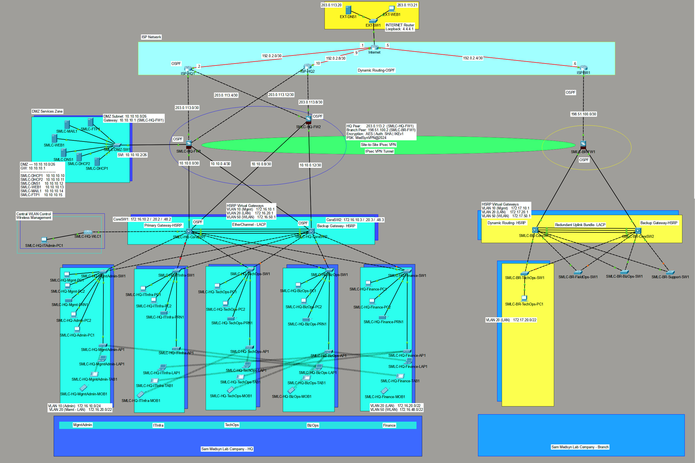

# MedSyn Lab Company — Enterprise Network Design

A complete enterprise network design and implementation project built in **Cisco Packet Tracer**, created as a final project for a LAN/Networking course at Nackademin.

---

## Project Overview

MedSyn is a fictional medical company with a headquarters site and a remote branch office. The goal was to design and configure a full enterprise network from scratch, covering routing, switching, security, VPN, wireless, DHCP, and high availability.

**All configurations are verified — the network is fully operational.**

---

## Network Topology



---

## Technologies Used

| Area | Technology |
|------|-----------|
| Routing | OSPF (process 15), static default routes |
| Switching | VLANs, 802.1Q trunking, STP, EtherChannel (LACP) |
| Firewall | Cisco ASA 5506 — NAT/PAT, ACLs, security zones |
| VPN | IPsec site-to-site (IKEv1, AES, SHA) |
| High Availability | HSRP (dual gateway per VLAN), dual ISP, dual firewall |
| Wireless | WLC + CAPWAP lightweight APs (LAP-PT), WPA2-PSK |
| DHCP | Centralised DHCP servers in DMZ with relay |
| DNS | Internal DMZ DNS server |
| Addressing | RFC 1918 LAN, RFC 5737 WAN simulation, RFC 3849 documentation ranges |

---

## Network Design Summary

### IP Address Plan

| Segment | Subnet | Purpose |
|---------|--------|---------|
| ISP — INTERNET ↔ ISP-HQ1 | 192.0.2.0/30 | WAN serial link |
| ISP — INTERNET ↔ ISP-BR1 | 192.0.2.4/30 | WAN serial link |
| ISP — INTERNET ↔ ISP-HQ2 | 192.0.2.8/30 | WAN serial link |
| External segment | 192.0.2.128/25 | Simulated internet hosts |
| HQ FW1 WAN | 203.0.113.0/30, .12/30 | Public uplinks |
| HQ FW2 WAN | 203.0.113.4/30, .8/30 | Public uplinks |
| Branch FW WAN | 198.51.100.0/30 | Branch public uplink |
| HQ FW ↔ Core | 10.10.0.0/30 pairs | Point-to-point /30 links |
| Branch FW ↔ Core | 10.10.1.0/30 pairs | Point-to-point /30 links |
| DMZ | 10.10.10.0/26 | Server zone |
| HQ VLAN 10 (Admin) | 172.16.10.0/24 | Admin workstations |
| HQ VLAN 20 (LAN) | 172.16.20.0/22 | HQ wired clients |
| HQ VLAN 50 (WLAN) | 172.16.48.0/22 | HQ wireless clients |
| Branch VLAN 10 | 172.17.10.0/24 | Branch admin |
| Branch VLAN 20 | 172.17.20.0/22 | Branch wired clients |

### HSRP Virtual Gateways

| VLAN | HQ VIP | Branch VIP |
|------|--------|-----------|
| VLAN 10 (Admin/Mgmt) | 172.16.10.1 | 172.17.10.1 |
| VLAN 20 (LAN) | 172.16.20.1 | 172.17.20.1 |
| VLAN 50 (WLAN) | 172.16.50.1 | 172.17.50.1 |

---

## Site Overview

### HQ Site

- **Firewall:** SMLC-HQ-FW1 (primary, DMZ) and SMLC-HQ-FW2 (secondary) — Cisco ASA
- **Core switches:** SMLC-HQ-CoreSW1 (HSRP Active) and SMLC-HQ-CoreSW2 (HSRP Standby), connected via EtherChannel
- **ISP uplinks:** Dual ISP — ISP-HQ1 and ISP-HQ2 for redundancy
- **Departments:** MgmtAdmin, BizOps, Finance, TechOps, ITInfra — each with a dedicated access switch
- **DMZ:** 6 servers — DHCP1, DHCP2, DNS1, WEB1, MAIL1, FTP1
- **Wireless:** SMLC-HQ-WLC1 managing 5 lightweight APs (one per department)

### Branch Site

- **Firewall:** SMLC-BR-FW1 — Cisco ASA
- **Core switches:** SMLC-BR-CoreSW1 (HSRP Active) and SMLC-BR-CoreSW2 (HSRP Standby), connected via EtherChannel
- **ISP uplink:** ISP-BR1 (single ISP)
- **Departments:** TechOps, FieldOps, BizOps, Support
- **VPN:** IPsec site-to-site tunnel to HQ via SMLC-HQ-FW1

---

## Repository Structure

```
MedSyn-Network-Design/
├── README.md
├── topology/
│   └── network_topology.jpg        — Full network topology screenshot
├── configs/
│   ├── HQ/                         — HQ device configurations
│   ├── Branch/                     — Branch device configurations
│   ├── ISP/                        — ISP and Internet router configs
│   └── DMZ/                        — DMZ switch and server configs
├── images/                         — Screenshot evidence per device
│   └── <device-name>/
├── docs/
│   ├── naming-conventions.md       — Device naming reference
│   └── vlan-design.md              — VLAN and department design
├── test-results/
│   ├── HQ_connectivity.md
│   ├── Branch_connectivity.md
│   ├── Wireless_AP_tests.md
│   └── Final_project_status.md
└── presentation/
    └── demo_script.md              — Live demo script
```

> **Note on images:** The `images/` folder contains per-device screenshot evidence (show commands, ping results). Copy the contents of `Agent_HandOff/confirmed_configs/image/` into `images/` to populate this folder.

---

## Key Features Demonstrated

- Dual-ISP, dual-firewall HQ architecture with full redundancy
- OSPF routing across all sites with consistent process ID and area 0
- HSRP gateway redundancy on all VLANs at both sites
- EtherChannel link aggregation between core switches
- IPsec site-to-site VPN between HQ and Branch
- NAT/PAT on all firewalls for internet access
- VLAN segmentation with 802.1Q trunking and native VLAN hardening (VLAN 99)
- Centralised DHCP from DMZ servers with ip helper-address relay
- WLC-managed wireless with CAPWAP lightweight APs across all HQ departments

---

## Verified Test Results

| Test | Result |
|------|--------|
| HQ LAN routing (HSRP VIP) | PASS — 4/4 |
| HQ → DMZ (DNS server) | PASS — 4/4 |
| HQ → Internet (NAT/PAT) | PASS — 4/4 |
| Branch internal routing | PASS — 5/5 |
| Branch → Internet | PASS — 5/5 |
| Branch → HQ via IPsec VPN | PASS — 5/5 |
| DHCP — all HQ departments | PASS |
| Wireless clients (all 5 APs) | PASS — all registered via CAPWAP |

See `test-results/` for full test logs.
