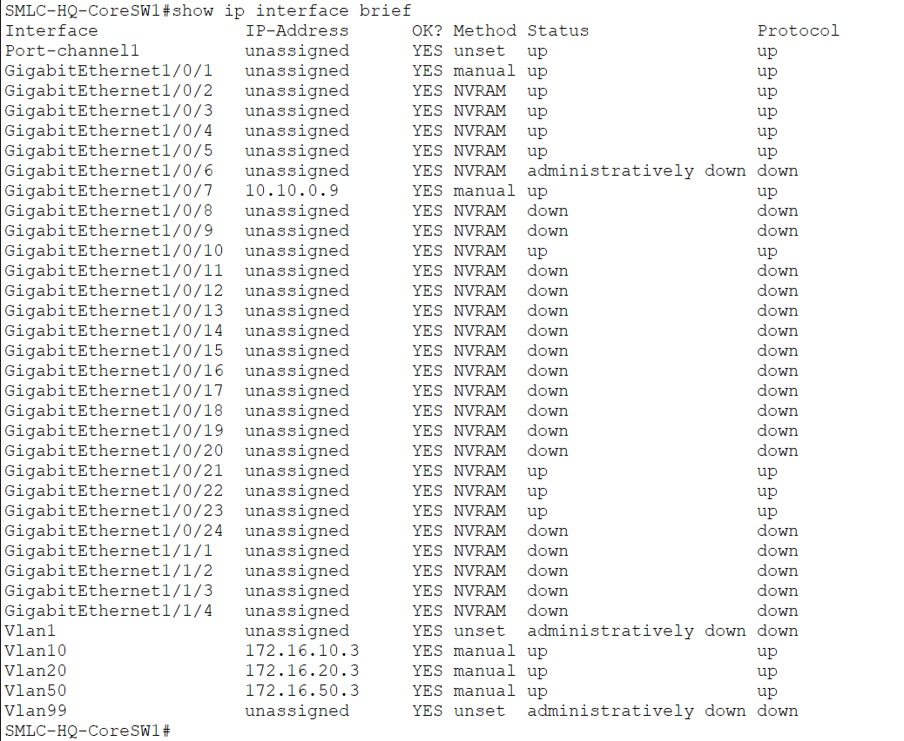
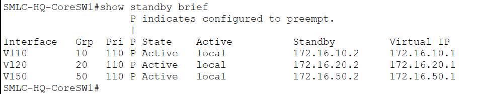
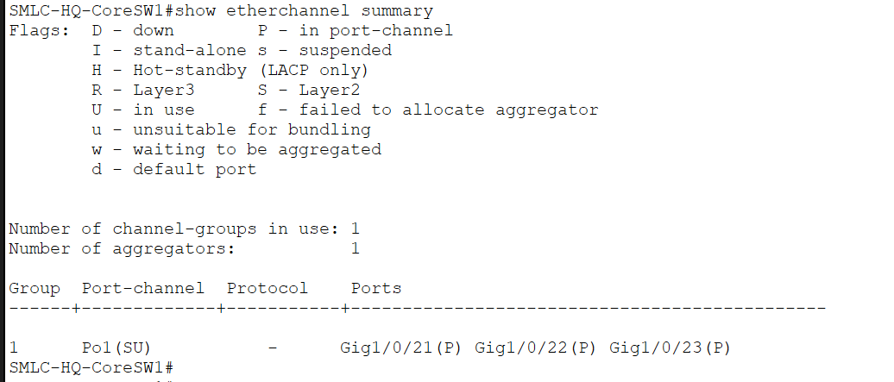

# SMLC-HQ-CoreSW1 — CONFIRMED ✓
Date confirmed: 2026-06-04

## show ip interface brief


> VLAN SVIs up — VLAN10 (172.16.10.3), VLAN20 (172.16.20.3), VLAN50 (172.16.50.3). Uplinks to both firewalls and all 5 department switches up.

```
Port-channel1         unassigned  up/up
GigabitEthernet1/0/1  10.10.0.1   up/up   → SMLC-HQ-FW1 INSIDE1
GigabitEthernet1/0/2  unassigned  up/up   → SMLC-HQ-MgmtAdmin-SW1 trunk
GigabitEthernet1/0/3  unassigned  up/up   → SMLC-HQ-BizOps-SW1 trunk
GigabitEthernet1/0/4  unassigned  up/up   → SMLC-HQ-Finance-SW1 trunk
GigabitEthernet1/0/5  unassigned  up/up   → SMLC-HQ-TechOps-SW1 trunk
GigabitEthernet1/0/7  10.10.0.9   up/up   → SMLC-HQ-FW2 INSIDE1
GigabitEthernet1/0/8  unassigned  down    → SMLC-HQ-ITInfra-SW1 (single uplink, expected)
GigabitEthernet1/0/10 unassigned  connected → SMLC-HQ-WLC1 (access VLAN50)
GigabitEthernet1/0/21 unassigned  up/up   → LACP to SMLC-HQ-CoreSW2
GigabitEthernet1/0/22 unassigned  up/up   → LACP to SMLC-HQ-CoreSW2
GigabitEthernet1/0/23 unassigned  up/up   → LACP to SMLC-HQ-CoreSW2
Vlan10               172.16.10.3  up/up
Vlan20               172.16.20.3  up/up
Vlan50               172.16.50.3  up/up
```

## HSRP


> HSRP ACTIVE on all three VLANs — VIPs 172.16.10.1, 172.16.20.1, 172.16.50.1. CoreSW2 is standby.

- HSRP ACTIVE (priority 110) for VLANs 10/20/50
- HSRP VIPs: 172.16.10.1, 172.16.20.1, 172.16.50.1

## EtherChannel


> Port-channel1 (Po1) up — Gi1/0/21, Gi1/0/22, Gi1/0/23 bundled. Link aggregation between CoreSW1 and CoreSW2 confirmed.

- LACP mode on, Gi1/0/21-23 → Port-channel1

## Key Config

- DHCP relay (ip helper-address 10.10.10.10 + 10.10.10.11) on all VLANs
- OSPF 15, RID 2.2.2.1
  - Networks: 10.10.0.0/30, 10.10.0.8/30, 172.16.10.0/24, 172.16.20.0/22, 172.16.50.0/22
  - passive-interface default; active on Gi1/0/1, Gi1/0/7

## Neighbour Map

| Interface   | IP            | Neighbour                | Neighbour IP |
|-------------|---------------|--------------------------|--------------|
| Gi1/0/1     | 10.10.0.1/30  | SMLC-HQ-FW1 Gi1/1        | 10.10.0.2    |
| Gi1/0/7     | 10.10.0.9/30  | SMLC-HQ-FW2 Gi1/1        | 10.10.0.10   |
| Gi1/0/2     | trunk         | SMLC-HQ-MgmtAdmin-SW1    | —            |
| Gi1/0/3     | trunk         | SMLC-HQ-BizOps-SW1       | —            |
| Gi1/0/4     | trunk         | SMLC-HQ-Finance-SW1      | —            |
| Gi1/0/5     | trunk         | SMLC-HQ-TechOps-SW1      | —            |
| Gi1/0/8     | trunk         | SMLC-HQ-ITInfra-SW1      | —            |
| Gi1/0/10    | access vlan50 | SMLC-HQ-WLC1             | 172.16.48.2  |
| Gi1/0/21-23 | Po1           | SMLC-HQ-CoreSW2 Gi1/0/21-23 | —         |
