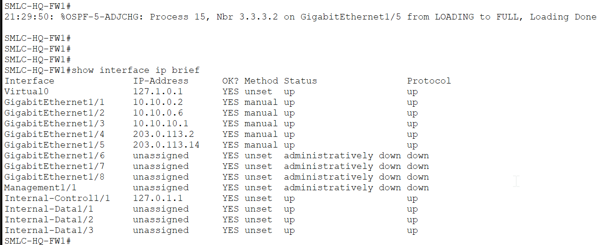
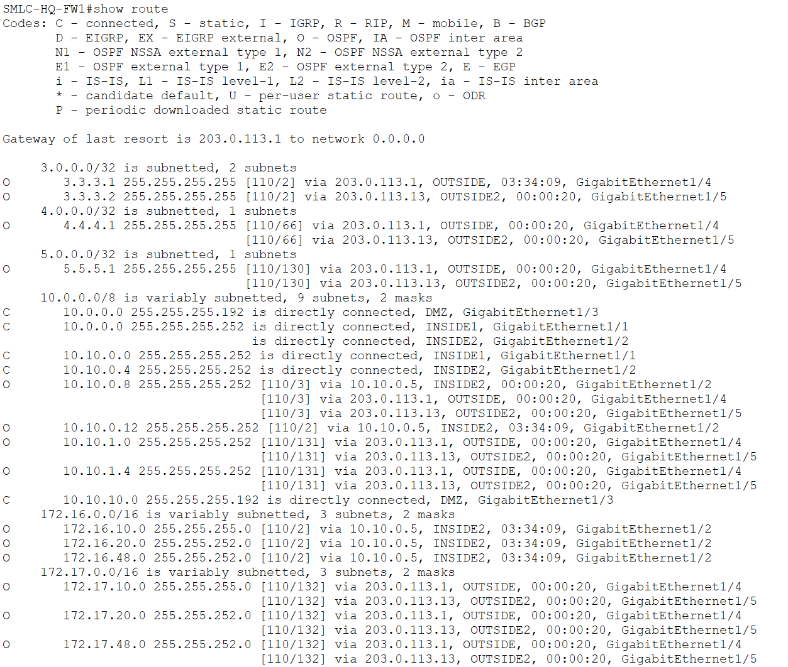
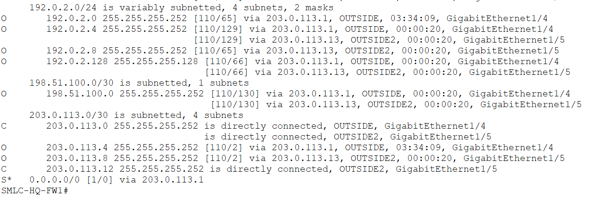
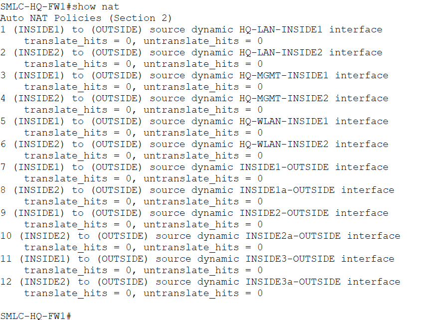

# SMLC-HQ-FW1 — CONFIRMED ✓
Date confirmed: 2026-06-04

## Interfaces

> Five named interfaces up — INSIDE1/2 toward CoreSW1/2, DMZ toward SMLC-DMZ-SW1, OUTSIDE toward ISP-HQ1, OUTSIDE2 toward ISP-HQ2.

| Interface | Nameif   | Security | IP                    |
|-----------|----------|----------|-----------------------|
| Gi1/1     | INSIDE1  | 100      | 10.10.0.2/30          |
| Gi1/2     | INSIDE2  | 100      | 10.10.0.6/30          |
| Gi1/3     | DMZ      | 70       | 10.10.10.1/26         |
| Gi1/4     | OUTSIDE  | 0        | 203.0.113.2/30        |
| Gi1/5     | OUTSIDE2 | 0        | 203.0.113.14/30       |

## Neighbour Map

| Interface | IP              | Neighbour              | Neighbour IP   |
|-----------|-----------------|------------------------|----------------|
| Gi1/4     | 203.0.113.2/30  | ISP-HQ1 Gi0/0          | 203.0.113.1    |
| Gi1/5     | 203.0.113.14/30 | ISP-HQ2 Gi0/1          | 203.0.113.13   |
| Gi1/3     | 10.10.10.1/26   | SMLC-DMZ-SW1           | —              |
| Gi1/1     | 10.10.0.2/30    | SMLC-HQ-CoreSW1 Gi1/0/1 | 10.10.0.1    |
| Gi1/2     | 10.10.0.6/30    | SMLC-HQ-CoreSW2 Gi1/0/1 | 10.10.0.5    |

## Routing

> Full OSPF routing table — HQ LAN/WLAN/Mgmt routes (172.16.x.x) via INSIDE2, Branch routes (172.17.x.x) via OUTSIDE confirming VPN-routed traffic, ISP loopbacks, and all WAN subnets learned via OSPF. Default route S* via 203.0.113.1.

- Default route: `route OUTSIDE 0.0.0.0 0.0.0.0 203.0.113.1 1`
- OSPF 15, RID 1.1.1.1, networks: 203.0.113.0/30, 203.0.113.12/30, 10.10.0.0/30, 10.10.0.4/30, 10.10.10.0/26

## VPN

> **Note — Packet Tracer limitation:** The ASA in PT does not display `show crypto isakmp sa` or `show crypto ipsec sa` output even when the tunnel is active. VPN functionality is verified by end-to-end ping below.

> SMLC-BR-TechOps-PC1 pinging HQ HSRP gateway 172.16.20.1 — 4/4 replies, 0% loss. Traffic travels encrypted through the IPsec tunnel between SMLC-BR-FW1 (198.51.100.2) and SMLC-HQ-FW1 (203.0.113.2).

- Peer: 198.51.100.2 (SMLC-BR-FW1)
- Transform: esp-aes esp-sha-hmac
- IKEv1 policy: encr aes, auth pre-share, group 2 (PT limitation — group 14 not supported)
- Crypto map CMAP on OUTSIDE interface

## NAT

> 12 Auto NAT policies configured — HQ-LAN, HQ-MGMT, and HQ-WLAN dynamic PAT rules on both INSIDE1 and INSIDE2 toward OUTSIDE. All three internal subnets covered for internet access.

- HQ-MGMT-INSIDE1/2: 172.16.10.0/24 → OUTSIDE dynamic interface
- HQ-LAN-INSIDE1/2: 172.16.20.0/22 → OUTSIDE dynamic interface
- HQ-WLAN-INSIDE1/2: 172.16.48.0/22 → OUTSIDE dynamic interface

## Notes
- `same-security-traffic permit inter-interface` and `intra-interface` confirmed active
