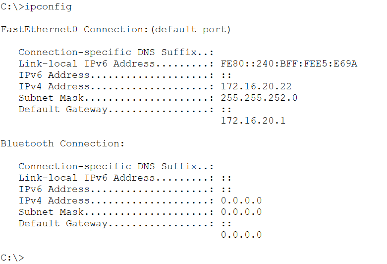
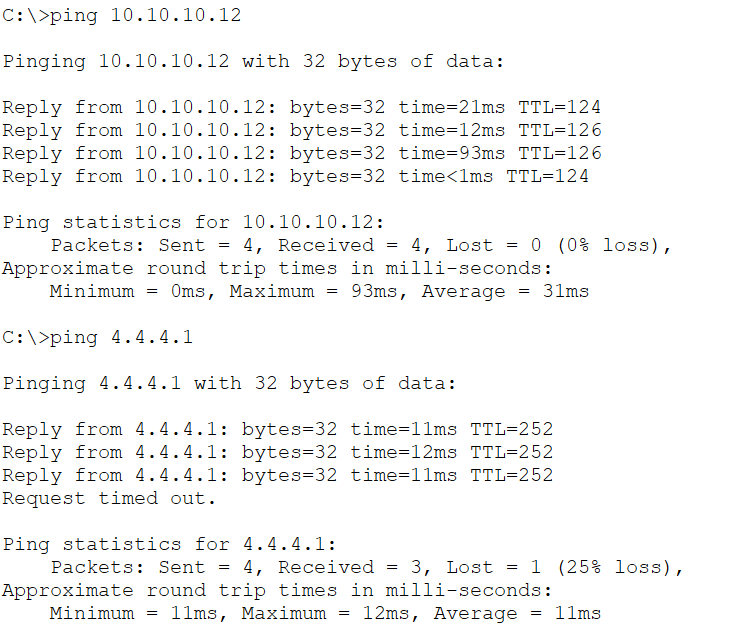

# SMLC-HQ-Mgmt-PC1 — CONFIRMED ✓
Date confirmed: 2026-06-09

**Role:** Normal MgmtAdmin department user PC — VLAN20 (Mgmt — LAN)

---

## ipconfig (DHCP confirmed)

> DHCP address 172.16.20.22/22 assigned by SMLC-DHCP1 in the DMZ. Gateway 172.16.20.1 = HSRP virtual IP served by SMLC-HQ-CoreSW1 (Active). DNS 10.10.10.12 = SMLC-DNS1.

| Field           | Value            |
|-----------------|------------------|
| IPv4 Address    | 172.16.20.22     |
| Subnet Mask     | 255.255.252.0    |
| Default Gateway | 172.16.20.1      |
| DNS Server      | 10.10.10.12      |
| VLAN            | 20 (Mgmt — LAN)  |

---

## Connectivity Tests

> Ping to SMLC-DNS1 (10.10.10.12) and INTERNET loopback (4.4.4.1) — confirms HQ LAN → DMZ and HQ LAN → Internet via NAT on SMLC-HQ-FW1.

---

## Notes

- Connected to SMLC-HQ-MgmtAdmin-SW1 Fa0/3 or Fa0/4 (VLAN20)
- Admin workstations (Admin-PC1, Admin-PC2) are on VLAN10 — Fa0/6-7
