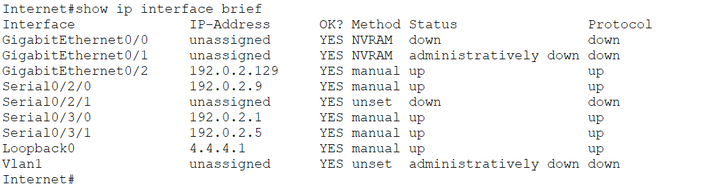
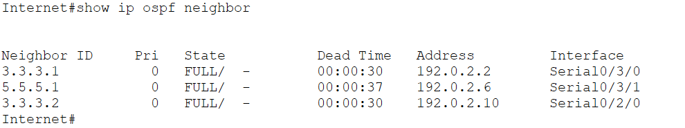

# INTERNET — CONFIRMED ✓
Date confirmed: 2026-06-04

## show ip interface brief


> All three serial WAN links up (S0/3/0 → ISP-HQ1, S0/3/1 → ISP-BR1, S0/2/0 → ISP-HQ2). Loopback0 4.4.4.1 up. Gi0/2 external segment up.

```
Interface              IP-Address      Status     Protocol
GigabitEthernet0/2     192.0.2.129     up         up
Serial0/2/0            192.0.2.9       up         up
Serial0/3/0            192.0.2.1       up         up
Serial0/3/1            192.0.2.5       up         up
Loopback0              4.4.4.1         up         up
```

## Running Config

```
hostname INTERNET
interface Loopback0
 ip address 4.4.4.1 255.255.255.255
interface Serial0/3/0
 description LINK_TO_ISP-HQ1
 ip address 192.0.2.1 255.255.255.252
interface Serial0/3/1
 description LINK_TO_ISP-BR1
 ip address 192.0.2.5 255.255.255.252
 clock rate 2000000
interface Serial0/2/0
 description LINK_TO_ISP-HQ2
 ip address 192.0.2.9 255.255.255.252
 clock rate 2000000
interface GigabitEthernet0/2
 description EXTERNAL_SEGMENT
 ip address 192.0.2.129 255.255.255.128
router ospf 15
 router-id 4.4.4.1
 network 4.4.4.1 0.0.0.0 area 0
 network 192.0.2.0 0.0.0.3 area 0
 network 192.0.2.4 0.0.0.3 area 0
 network 192.0.2.8 0.0.0.3 area 0
 network 192.0.2.128 0.0.0.127 area 0
```

## show ip ospf neighbor


> All three ISP neighbours FULL — ISP-HQ1 (3.3.3.1), ISP-HQ2 (3.3.3.2), ISP-BR1 (5.5.5.1). OSPF process 15 routing the full WAN backbone.

```
Neighbor ID     Pri   State       Address       Interface
3.3.3.1           0   FULL/  -    192.0.2.2     Serial0/3/0
5.5.5.1           0   FULL/  -    192.0.2.6     Serial0/3/1
3.3.3.2           0   FULL/  -    192.0.2.10    Serial0/2/0
```

## Interface ↔ Neighbour Map

| PT Interface  | IP             | Neighbour        | Neighbour IP  |
|---------------|----------------|------------------|---------------|
| Serial0/3/0   | 192.0.2.1/30   | ISP-HQ1 S0/3/0   | 192.0.2.2     |
| Serial0/3/1   | 192.0.2.5/30   | ISP-BR1 S0/3/0   | 192.0.2.6     |
| Serial0/2/0   | 192.0.2.9/30   | ISP-HQ2 S0/3/0   | 192.0.2.10    |
| Gi0/2         | 192.0.2.129/25 | External segment | EXT-WEB1 .200 |
