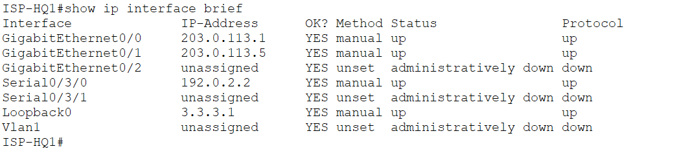
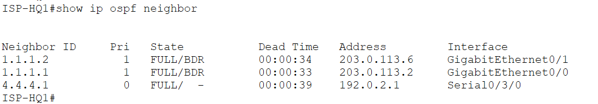

# ISP-HQ1 — CONFIRMED ✓
Date confirmed: 2026-06-04

## show ip interface brief


> Serial0/3/0 (192.0.2.2) up toward INTERNET. Gi0/0 (203.0.113.1) toward SMLC-HQ-FW1, Gi0/1 (203.0.113.5) toward SMLC-HQ-FW2. Loopback0 3.3.3.1 = OSPF router-id.

```
Interface              IP-Address      Status     Protocol
GigabitEthernet0/0     203.0.113.1     up         up
GigabitEthernet0/1     203.0.113.5     up         up
Serial0/3/0            192.0.2.2       up         up
Loopback0              3.3.3.1         up         up
```

## show ip ospf neighbor


> Three OSPF neighbours FULL — INTERNET (4.4.4.1) via Serial, SMLC-HQ-FW1 (1.1.1.1) and SMLC-HQ-FW2 (1.1.1.2) via Gigabit downlinks.

```
Neighbor ID     Pri   State       Address        Interface
1.1.1.2           1   FULL/BDR    203.0.113.6    GigabitEthernet0/1
1.1.1.1           1   FULL/BDR    203.0.113.2    GigabitEthernet0/0
4.4.4.1           0   FULL/  -    192.0.2.1      Serial0/3/0
```

## Interface ↔ Neighbour Map

| PT Interface | IP              | Neighbour                  | Neighbour IP  |
|--------------|-----------------|----------------------------|---------------|
| Serial0/3/0  | 192.0.2.2/30    | INTERNET Serial0/3/0       | 192.0.2.1     |
| Gi0/0        | 203.0.113.1/30  | SMLC-HQ-FW1 Gi1/4 OUTSIDE  | 203.0.113.2   |
| Gi0/1        | 203.0.113.5/30  | SMLC-HQ-FW2 Gi1/3 OUTSIDE  | 203.0.113.6   |
| Loopback0    | 3.3.3.1/32      | OSPF router-id              | —             |

## OSPF

- Process 15, router-id 3.3.3.1
- Networks: 3.3.3.1/32, 192.0.2.0/30, 203.0.113.0/30, 203.0.113.4/30
